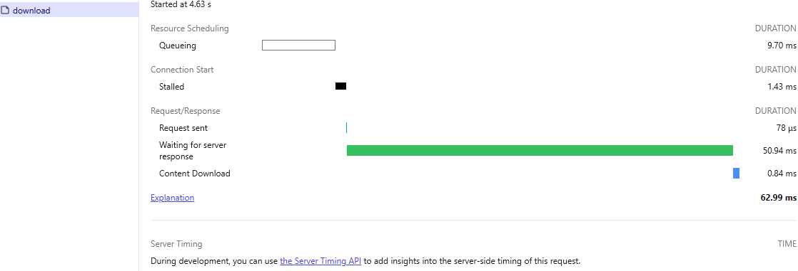
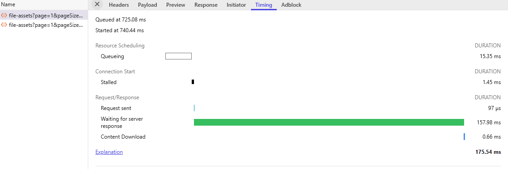
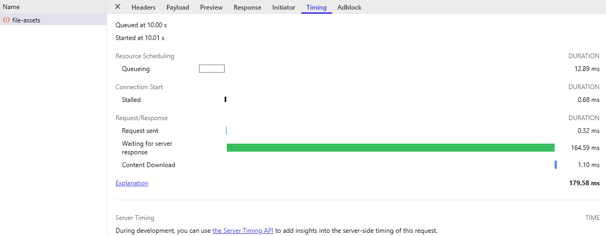
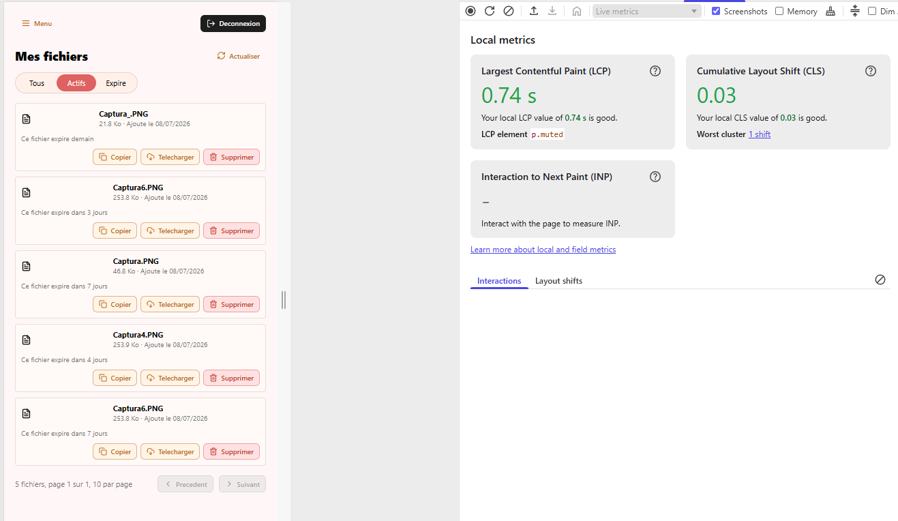

# PERF.md — DataShare

Ce document présente le suivi de performance réalisé pour le MVP DataShare. Il couvre les objectifs de performance retenus, les mesures effectuées depuis le navigateur, leur interprétation, ainsi que les limites connues du test.

Les mesures ci-dessous ont été réalisées en environnement local, à partir des Chrome DevTools, sur une application lancée en développement.

---

## 1. Objectifs de performance du MVP

L’objectif du MVP n’est pas de valider une montée en charge réelle, mais de vérifier que les parcours critiques restent réactifs et que les choix d’architecture ne bloquent pas les performances de base.

| Élément mesuré | Objectif MVP |
|---|---:|
| Affichage initial d’un écran principal | < 2 s |
| Navigation entre pages | < 500 ms |
| Réponse d’un endpoint courant | < 500 ms en local |
| Consultation de l’historique paginé | < 500 ms en local |
| Upload d’un petit fichier de test | < 500 ms en local, hors fichier volumineux |
| Download d’un petit fichier de test | < 500 ms en local, hors fichier volumineux |
| Stabilité visuelle frontend | CLS proche de 0 |

Ces seuils sont indicatifs et adaptés au contexte local du MVP. Ils devront être revus avant une mise en production réelle, notamment avec des tests de charge.

---

## 2. Points critiques identifiés

Les opérations les plus sensibles pour DataShare sont :

- le téléversement de fichiers ;
- le téléchargement via lien public ;
- la consultation paginée de l’historique utilisateur ;
- le chargement initial des écrans frontend ;
- la stabilité visuelle de l’interface.

Les fichiers binaires ne sont pas stockés en base de données. PostgreSQL conserve uniquement les métadonnées. Les opérations d’upload et de download doivent être traitées en streaming afin d’éviter le chargement complet du fichier en mémoire.

---

## 3. Méthodologie de test

Les mesures ont été effectuées avec Chrome DevTools :

- onglet **Network** pour les temps de réponse API ;
- détail **Timing** pour distinguer l’attente serveur et le téléchargement de contenu ;
- onglet **Performance / Local metrics** pour les métriques frontend visibles localement.

Contexte du test :

| Élément | Valeur |
|---|---|
| Environnement | Local development |
| Frontend | React / Vite |
| Backend | NestJS |
| Base de données | PostgreSQL local |
| Navigateur | Chrome / DevTools |
| Cache | Mesure réalisée depuis les outils navigateur |
| Données | Fichiers de test légers, historique de quelques fichiers |

---

## 4. Résultats observés

### 4.1 Téléchargement d’un fichier

Endpoint / action testée :

```http
POST /share-links/{token}/download
```

Résultat observé dans Chrome DevTools :

| Mesure | Valeur |
|---|---:|
| Temps total | 62.99 ms |
| Waiting for server response | 50.94 ms |
| Content download | 0.84 ms |
| Request sent | 78 µs |
| Stalled | 1.43 ms |
| Statut fonctionnel | Téléchargement réussi |

Interprétation :

Le téléchargement d’un fichier léger est rapide en environnement local. La majorité du temps est passée en attente de la réponse serveur, ce qui est normal pour une requête impliquant une vérification du lien, un éventuel contrôle de mot de passe et l’ouverture du flux fichier. Le temps de téléchargement du contenu est très faible sur ce fichier de test.

Capture associée :



---

### 4.2 Consultation de l’historique utilisateur

Endpoint / action testée :

```http
GET /me/file-assets?page=1&pageSize=10&status=active
```

Résultat observé dans Chrome DevTools :

| Mesure | Valeur |
|---|---:|
| Temps total | 175.54 ms |
| Waiting for server response | 157.98 ms |
| Content download | 0.66 ms |
| Request sent | 97 µs |
| Stalled | 1.45 ms |
| Queueing | 15.35 ms |
| Statut fonctionnel | Historique affiché |

Interprétation :

Le temps de réponse reste inférieur au seuil MVP de 500 ms. L’endpoint utilise une pagination, ce qui limite le volume de données retourné et évite de charger tout l’historique utilisateur. La taille du téléchargement de contenu est très faible, car seules les métadonnées des fichiers sont transférées.

Capture associée :



---

### 4.3 Upload d’un fichier

Endpoint / action testée :

```http
POST /file-assets
```

Résultat observé dans Chrome DevTools :

| Mesure | Valeur |
|---|---:|
| Temps total | 179.58 ms |
| Waiting for server response | 164.59 ms |
| Content download | 1.10 ms |
| Request sent | 0.32 ms |
| Stalled | 0.68 ms |
| Queueing | 12.89 ms |
| Statut fonctionnel | Upload réussi |

Interprétation :

L’upload d’un fichier léger reste inférieur au seuil MVP de 500 ms. Le temps principal correspond au traitement serveur : réception du fichier, validation, écriture dans le stockage local, création des métadonnées et génération du lien de partage. Ce résultat est satisfaisant pour le MVP local.

Capture associée :



---

### 4.4 Métriques frontend locales

Écran testé :

```text
Mon espace / Mes fichiers
```

Résultat observé dans Chrome DevTools :

| Métrique | Valeur | Interprétation |
|---|---:|---|
| Largest Contentful Paint (LCP) | 0.74 s | Bon résultat local, inférieur à l’objectif de 2 s |
| Cumulative Layout Shift (CLS) | 0.03 | Bonne stabilité visuelle |
| Interaction to Next Paint (INP) | Non mesuré | Nécessite une interaction utilisateur pendant l’enregistrement |

Interprétation :

L’écran d’historique se charge rapidement en local. Le LCP observé est largement inférieur au budget de 2 secondes. Le CLS est proche de zéro, ce qui indique que la mise en page est stable et ne provoque pas de déplacements visuels importants pendant le chargement.

Capture associée :



---

## 5. Budget de performance frontend

Le budget de performance côté frontend est volontairement simple pour le MVP.

| Indicateur | Objectif |
|---|---:|
| Affichage initial d’un écran principal | < 2 s |
| Navigation entre pages | < 500 ms |
| LCP local | < 2 s |
| CLS | < 0.1 |
| Chargement de l’historique | Pagination obligatoire |
| Librairies UI | Éviter les dépendances lourdes non nécessaires |
| Images et assets | Limiter et optimiser les ressources |


---

## 6. Synthèse des résultats

| Test | Résultat observé | Objectif MVP | Statut |
|---|---:|---:|---|
| Download fichier | 62.99 ms | < 500 ms | Conforme |
| Historique utilisateur | 175.54 ms | < 500 ms | Conforme |
| Upload fichier léger | 179.58 ms | < 500 ms | Conforme |
| LCP écran historique | 0.74 s | < 2 s | Conforme |
| CLS écran historique | 0.03 | < 0.1 | Conforme |

Les résultats observés sont satisfaisants pour un MVP local. Les endpoints testés restent sous les seuils fixés et l’écran d’historique présente un bon comportement frontend.

---

## 7. Limites du test

Les mesures présentées sont des mesures locales et ponctuelles. Elles ne remplacent pas un test de charge complet.

Limites connues :

- environnement local, non représentatif d’une production réelle ;
- faible volume de données ;
- fichiers de test légers ;
- absence de concurrence utilisateur ;
- absence de mesure mémoire serveur ;
- absence de test avec fichiers proches de la limite de 1 Go.

---

## 8. Évolutions prévues

Une campagne de test avec k6 pourra être ajoutée ultérieurement afin de simuler plusieurs utilisateurs virtuels sur les endpoints critiques :

```http
POST /file-assets
POST /share-links/{token}/download
GET /me/file-assets?page=1&pageSize=10&status=all
```

Objectifs futurs :

- mesurer le comportement sous charge ;
- vérifier la stabilité de l’upload/download en concurrence ;
- surveiller la consommation mémoire ;
